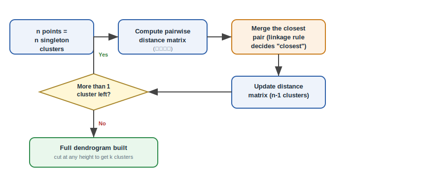
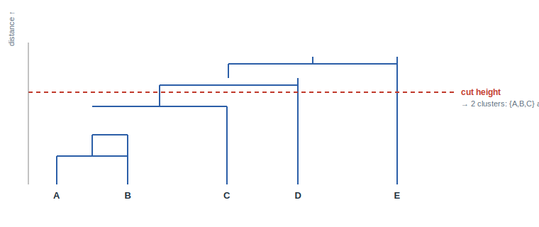

<div align="center">

# 🌳 Hierarchical Clustering — From Theory to Practice
### A Complete Beginner-to-Industry Reference Guide

[](https://github.com/anomalyco/ML-Intern-Work)
[](https://github.com/anomalyco/ML-Intern-Work)
[](https://github.com/anomalyco/ML-Intern-Work)
[](https://github.com/anomalyco/ML-Intern-Work)

*Building structure from the bottom up — one merge at a time.*

</div>

---

## 📌 About This Document

> This README documents **Hierarchical Clustering** in a way that works for three audiences at once: a **first-year B.Tech student** learning the concept for the first time, an **ML trainer** teaching it in a classroom, and a **working professional** using it as a quick technical reference.

Use this document for:
- 🎓 Academic learning & semester projects
- 💼 Internship submissions & reports
- 🧠 Placement & interview preparation
- 📊 Quick on-the-job reference

**What makes hierarchical clustering special?** Unlike K-Means or DBSCAN (which produce a single flat partition), hierarchical clustering builds a complete **tree of relationships** — a dendrogram — so you can see nested structure at every resolution. It answers not just "which cluster?" but "how are clusters related to each other?"

**Estimated reading time:** 30–40 minutes.

---

## 📑 Table of Contents

1. [What is Hierarchical Clustering?](#-1-what-is-hierarchical-clustering)
2. [Types of Hierarchical Clustering](#-2-types-of-hierarchical-clustering)
3. [Mathematical Formulation](#-3-mathematical-formulation)
4. [Comprehensive Symbol Table](#-4-comprehensive-symbol-table)
5. [How It Works — Step by Step](#-5-how-it-works--step-by-step)
6. [Dendrogram Interpretation Guide](#-6-dendrogram-interpretation-guide)
7. [Key Assumptions](#-7-key-assumptions)
8. [When to Use / When Not to Use](#-8-when-to-use--when-not-to-use)
9. [Implementation Overview](#-9-implementation-overview)
10. [Real-World Applications](#-10-real-world-applications)
11. [Evaluation Metrics for Hierarchical Clustering](#-11-evaluation-metrics-for-hierarchical-clustering)
12. [Quick Reference Table](#-12-quick-reference-table)
13. [Top 5 Interview Questions](#-13-top-5-interview-questions)
14. [Best Practices & Common Mistakes](#-14-best-practices--common-mistakes)
15. [Failure Cases & Debugging Guide](#-15-failure-cases--debugging-guide)
16. [References & Further Reading](#-16-references--further-reading)

---

## 🧩 1. What is Hierarchical Clustering?

**Hierarchical clustering** is an unsupervised learning method that organizes data points into a **tree-like structure of nested groups** (a **dendrogram**), rather than assigning each point to a single flat cluster. Instead of asking *"which of k buckets does this point belong to?"* (as K-Means does), it asks *"which two things are most alike right now?"* and merges them — repeating this question until everything has merged into one root.

> **Formal definition:** Given a dataset $X = \{x_1, x_2, ..., x_n\}$ with $x_i \in \mathbb{R}^d$, hierarchical clustering produces a rooted binary tree $T$ where:
> - Each leaf of $T$ is a single data point
> - Each internal node represents the merger of its two children
> - The root represents the entire dataset merged into one cluster
> - Cutting $T$ at any height $h$ yields a flat partition of the data

> **Analogy — A Family Tree of Data:** Think of how species are grouped in biology. Individual organisms are the leaves; closely related organisms merge into species, species into genera, genera into families, and so on, until everything traces back to a single common ancestor. Nobody decided in advance "there will be exactly 7 phyla" — the grouping emerged from similarity. Hierarchical clustering does the same thing with vectors of numbers: it builds the whole family tree of your data and lets you choose the resolution afterward.

> **Analogy — Networking Event:** Imagine a room full of strangers. First, everyone stands alone. The two people who discover they have the most in common pair up (first merge). Now pairs and singles mingle; the next closest pair (person-person or person-group) merges. This continues until everyone is in one big group. Later, you can look back and say "at the 5-group level, the room split into these cliques" — that's cutting the dendrogram.

### Why Does Hierarchical Clustering Matter?

| Reason | Real-World Example |
|--------|-------------------|
| Discover **nested structure** | Biological taxonomy: species → genus → family → order |
| **No need to pre-specify K** | You don't know how many customer segments exist — build the tree and decide later |
| **Interpretable merge history** | Medical research: trace which patient subgroups merged at which distance threshold |
| **Single run covers all K** | One dendrogram gives answers for K = 1, 2, ..., n — no need to re-run for different K values |
| **Deterministic output** | Same data + same linkage = same dendrogram every time (unlike K-Means) |

---

## 🗂 2. Types of Hierarchical Clustering

There are two directions to build the tree:

### Agglomerative Clustering (Bottom-Up) — ✅ Most Common

Start with every point as its own cluster. Repeatedly merge the two closest clusters until only one remains.

```text
Step 0: [A] [B] [C] [D] [E]     ← each point is its own cluster
Step 1: [A B] [C] [D] [E]       ← A and B are closest → merge
Step 2: [A B] [C D] [E]         ← C and D are closest → merge
Step 3: [A B] [C D E]           ← E merges with [C D]
Step 4: [A B C D E]             ← final merge → one cluster
```

**This is the focus of this guide.** It is the default in scikit-learn (`AgglomerativeClustering`) and SciPy (`scipy.cluster.hierarchy.linkage`).

### Divisive Clustering (Top-Down) — ❌ Rare

Start with one giant cluster containing all points. Repeatedly split clusters recursively until each point is alone. Conceptually elegant but computationally expensive ($O(2^n)$ in the naive case) — not used in practice for real data.

### Key Difference

| Aspect | Agglomerative | Divisive |
|--------|--------------|----------|
| Direction | Bottom-up | Top-down |
| Starting state | n clusters (each point alone) | 1 cluster (all data) |
| Complexity | $O(n^3)$ naive, $O(n^2 \log n)$ optimized | $O(2^n)$ naive — impractical |
| Common in practice | ✅ Yes | ❌ No |
| scikit-learn support | ✅ `AgglomerativeClustering` | ❌ Not available |



---

## 🧮 3. Mathematical Formulation

### 3.1 Distance Between Points

Before measuring distance between *clusters*, you need a base distance between individual *points*:

| Metric | Formula | When to Use |
|--------|---------|-------------|
| **Euclidean** (default) | $\sqrt{\sum_{j=1}^d (x_j - y_j)^2}$ | Continuous numeric data; required for Ward linkage |
| **Manhattan** | $\sum_{j=1}^d \|x_j - y_j\|$ | High-dimensional or outlier-prone data |
| **Cosine** | $1 - \frac{x \cdot y}{\|x\|\|y\|}$ | Text data, embeddings — direction matters more than magnitude |

### 3.2 Linkage Criteria — The Distance Between Clusters

The entire algorithm hinges on one design choice: **how do you measure the distance between two clusters?** This is called the **linkage criterion**, and it is the single most interview-relevant concept in this topic.

#### Single Linkage (Nearest Neighbor)

$$d_{\text{single}}(A, B) = \min \{ d(x, y) : x \in A, y \in B \}$$

| Symbol | Meaning |
|--------|---------|
| $A, B$ | Two clusters being considered for merging |
| $x, y$ | Individual data points inside A and B |
| $d(x, y)$ | Base distance between points (typically Euclidean) |
| $\min$ | Take the smallest distance among all point pairs |

**Intuition:** Two clusters are as close as their closest points are.

**Practical insight:** This produces long, snake-like "chained" clusters. A single point acting as a "bridge" between two otherwise separate groups can cause a chain reaction merge. **Bad for most real-world data** but useful for detecting elongated structures.

**Failure mode:** The **chaining effect** — clusters that should be separate get connected through a thin line of intermediate points.

---

#### Complete Linkage (Farthest Neighbor)

$$d_{\text{complete}}(A, B) = \max \{ d(x, y) : x \in A, y \in B \}$$

| Symbol | Meaning |
|--------|---------|
| $\max$ | Take the largest distance among all point pairs |

**Intuition:** Two clusters are as close as their farthest points are.

**Practical insight:** Produces tight, compact, roughly spherical clusters. More robust to chaining than single linkage but sensitive to outliers — a single far-away point in a cluster makes it seem "larger" than it really is.

**Failure mode:** Outliers inflate the apparent cluster size, causing legitimate points to be merged late or incorrectly.

---

#### Average Linkage (UPGMA)

$$d_{\text{average}}(A, B) = \frac{1}{|A| \cdot |B|} \sum_{x \in A} \sum_{y \in B} d(x, y)$$

| Symbol | Meaning |
|--------|---------|
| $|A|, |B|$ | Number of points in clusters A and B |
| $\sum_{x \in A} \sum_{y \in B}$ | Sum over every pair of points (one from A, one from B) |

**Intuition:** Two clusters are as close as the average pair of points is.

**Practical insight:** Balances single and complete linkage. Less sensitive to outliers than complete, less prone to chaining than single. A good default when you're unsure which linkage to use. Weighted variants (WPGMA) exist that treat clusters equally regardless of size.

**Why this matters:** This is the only linkage that considers **all** point pairs equally — it doesn't rely on extremes (min or max).

---

#### Ward's Linkage (Minimum Variance)

$$d_{\text{Ward}}(A, B) = \sqrt{\frac{2|A||B|}{|A| + |B|}} \cdot \|c_A - c_B\|$$

| Symbol | Meaning |
|--------|---------|
| $c_A, c_B$ | Centroids (mean vectors) of clusters A and B |
| $\|c_A - c_B\|$ | Euclidean distance between centroids |
| $\frac{2|A||B|}{|A| + |B|}$ | Size normalization factor — larger clusters get more weight |

**Intuition:** Ward's linkage doesn't measure point-to-point distance at all. Instead, it measures **how much the total within-cluster variance would increase** if two clusters merged. It merges the pair that causes the smallest increase in variance.

**Practical insight:** Directly optimizes for low-variance, compact, spherical clusters. Tends to be the **strongest default choice** for most datasets because it produces balanced, interpretable clusters. However, it **requires Euclidean distance** — using it with Manhattan or cosine silently breaks the variance-minimization guarantee.

**Why this matters mathematically:** Ward's linkage is the only linkage that has an explicit **objective function** (minimum increase in total within-cluster sum of squares). The others are heuristics.

---

### 3.3 Lance-Williams Update Formula

Instead of recomputing distances from scratch after every merge, hierarchical clustering uses the **Lance-Williams recurrence** — a clever formula that computes the new distance between merged cluster $(A \cup B)$ and any other cluster $C$ using only the old distances:

$$d(A \cup B, C) = \alpha_A \cdot d(A, C) + \alpha_B \cdot d(B, C) + \beta \cdot d(A, B) + \gamma \cdot |d(A, C) - d(B, C)|$$

where $\alpha_A, \alpha_B, \beta, \gamma$ are linkage-specific constants. This is what makes hierarchical clustering computationally feasible — $O(n^2)$ instead of $O(n^3)$ for naive implementations.

> **Practical insight:** You don't need to memorize the Lance-Williams constants for interviews, but understanding *that* this update exists shows deep knowledge. It's the key optimization that makes agglomerative clustering run in reasonable time.

### 3.4 Cophenetic Correlation Coefficient

A quantitative measure of how faithfully the dendrogram represents the original pairwise distances:

$$c = \frac{\sum_{i < j} (d_{ij} - \bar{d})(t_{ij} - \bar{t})}{\sqrt{\sum_{i < j} (d_{ij} - \bar{d})^2 \cdot \sum_{i < j} (t_{ij} - \bar{t})^2}}$$

| Symbol | Meaning |
|--------|---------|
| $d_{ij}$ | Original distance between points i and j |
| $t_{ij}$ | Cophenetic distance — the height at which i and j are first merged in the dendrogram |
| $\bar{d}, \bar{t}$ | Mean of original and cophenetic distances |

**Range:** $[-1, 1]$. Higher is better. A cophenetic correlation > 0.8 generally indicates the dendrogram is a faithful representation of the original distance structure.

> **Practical insight:** If the cophenetic correlation is low (< 0.6), the dendrogram is distorting the true relationships — consider a different linkage method or distance metric.

---

## 📖 4. Comprehensive Symbol Table

| Symbol | Meaning | Used In |
|--------|---------|---------|
| $n$ | Number of data points | All |
| $d$ | Number of features (dimensions) | All |
| $x_i$ | i-th data point (a vector in $\mathbb{R}^d$) | All |
| $A, B, C$ | Cluster labels (sets of points) | Linkage formulas |
| $|A|$ | Number of points in cluster A | Average, Ward linkage |
| $c_A$ | Centroid (mean vector) of cluster A | Ward linkage |
| $d(x, y)$ | Distance between points x and y | Base distance |
| $d(A, B)$ | Distance between clusters A and B | Linkage criterion |
| $d_{ij}$ | Original pairwise distance between points i and j | Cophenetic correlation |
| $t_{ij}$ | Cophenetic distance — merge height of i and j | Cophenetic correlation |
| $Z$ | Linkage matrix (n-1 × 4) storing merge history | SciPy output |
| $h$ | Height (distance threshold) for cutting the dendrogram | Tree cutting |
| $k$ | Number of flat clusters after cutting | Tree cutting |

---

## ⚙️ 5. How It Works — Step by Step

### Agglomerative Algorithm

```text
Algorithm: Agglomerative Hierarchical Clustering

Input  : Dataset X with n points, linkage criterion
Output : Dendrogram (hierarchy of n-1 merges)

1. Initialize n clusters — one per data point
2. Compute the n × n pairwise distance matrix
3. WHILE more than 1 cluster remains:
     a. Find the pair of clusters (A, B) with the smallest
        linkage distance d(A, B)
     b. MERGE A and B into a new cluster A ∪ B
     c. UPDATE the distance matrix:
        - Remove rows/cols for A and B
        - Add row/col for A ∪ B using Lance-Williams update
     d. Record the merge in the linkage matrix Z
4. Return: linkage matrix Z with (n-1) merge records
5. OPTIONAL: Cut the dendrogram at height h (or to get k clusters)
   to produce a flat partition
```

### Detailed Walkthrough (with the networking event analogy)

**Step 1 — Start with singletons.** Treat every data point as its own cluster.
> *Analogy:* Every person at a networking event starts out alone.

**Step 2 — Compute the distance matrix.** Calculate pairwise distances between every cluster (initially, between every pair of points).
> *Analogy:* Everyone briefly sizes up everyone else in the room.

**Step 3 — Merge the closest pair.** Using your chosen linkage formula, merge the two clusters that are most similar.
> *Analogy:* The two people with the most in common pair up first.

**Step 4 — Update the distance matrix.** Recompute distances involving the newly merged cluster using Lance-Williams; all other distances stay the same.
> *Analogy:* Now the merged pair acts as a unit. Other individuals and groups assess their distance to this new pair.

**Step 5 — Repeat steps 3–4.** Keep merging the closest remaining pair until only one cluster (the root) remains.
> *Analogy:* Small groups merge into bigger groups, eventually becoming one large gathering.

**Step 6 — Cut the tree.** Choose a height (distance threshold) or a target number of clusters, and slice the dendrogram horizontally at that level to get your final groups.
> *Analogy:* Deciding whether to call the room "one party," "five friend groups," or "twenty individual conversations" — same tree, different cut.



```text
                    ┌─────────────────────────┐
                    │  Original Data (n points) │
                    └────────────┬─────────────┘
                                 ▼
                    ┌─────────────────────────┐
                    │  Compute Distance Matrix │
                    │       (n × n)           │
                    └────────────┬─────────────┘
                                 ▼
                    ┌─────────────────────────┐
                    │  Find Closest Pair (A,B) │
                    │  using linkage criterion │
                    └────────────┬─────────────┘
                                 ▼
                    ┌─────────────────────────┐
                    │   MERGE A and B into     │
                    │      new cluster C       │
                    └────────────┬─────────────┘
                                 ▼
                    ┌─────────────────────────┐
                    │  Update Distance Matrix  │
                    │  (Lance-Williams update) │
                    └────────────┬─────────────┘
                                 ▼
                    ┌─────────────────────────┐
                    │   More than 1 cluster?   │
                    │   ┌─── Yes ───► Step 3  │
                    │   └─── No ───► DONE     │
                    └─────────────────────────┘
                                 ▼
                    ┌─────────────────────────┐
                    │  Return Linkage Matrix Z │
                    │     (n-1 merge records)  │
                    └─────────────────────────┘
```

---

## 📊 6. Dendrogram Interpretation Guide

A dendrogram is a tree diagram showing the hierarchical relationships between data points. Here's how to read one:

```text
Height
  │     ╱╲
  │   ╱  ╲  ╱╲
  │ ╱    ╲╱  ╲
  │ ╲    ╱    ╲
  │  ╲  ╱      ╲
  │   ╲╱        ╲
  │    │          │
  ────┴──────────┴───── Data points (leaves)
     A  B  C     D  E
```

### How to Read a Dendrogram

| Feature | What It Means | Practical Guidance |
|---------|---------------|-------------------|
| **Vertical lines** | Merges between clusters | Height of merge = distance at which clusters combined |
| **Horizontal lines** | Connect clusters that merged | Longer horizontal line = more separation between groups |
| **Leaf order** | Optimized for display (no inherent meaning) | Don't over-interpret left-to-right ordering |
| **Height of merge** | How different the merged clusters were | Tall merges = very different clusters; short merges = similar clusters |

### How to Cut a Dendrogram

**Method 1 — Largest vertical gap:** Look for the longest unbroken vertical line in the dendrogram. Cut horizontally at that height. This captures the most natural cluster separation.

```text
Height
  │              ← CUT HERE (largest gap)
  │   ╱╲
  │ ╱    ╲  ╱╲
  │╱      ╲╱  ╲
  ────────┴──────
```

**Method 2 — Target K:** Cut to get exactly K clusters by tracing the dendrogram top-down until K branches remain.

**Method 3 — Distance threshold:** Cut at a specific height (distance value). All clusters that merged below that threshold stay grouped.

> **Practical insight:** The dendrogram is NOT a clustering — it's a tool for *deciding* your clustering. Always show the dendrogram to stakeholders (not just the flat labels) to justify your choice of K.

---

## 📐 7. Key Assumptions

| # | Assumption | Why It Matters | What Happens If Violated | How to Detect / Fix |
|---|-----------|---------------|--------------------------|---------------------|
| 1 | **A meaningful distance metric exists for your data** | All merges are based on pairwise distances | Clusters are geometrically valid but semantically wrong | Choose metric based on data type (Euclidean for continuous, cosine for text) |
| 2 | **Chosen linkage matches expected cluster geometry** | Ward = spherical, single = elongated, average = balanced | Wrong linkage fragments true clusters or merges unrelated ones | Try 2–3 linkages; compare with cophenetic correlation |
| 3 | **Ward requires Euclidean distance** | Ward's variance-minimization guarantee depends on Euclidean geometry | Produces unstable, uninterpretable merges | Only use Ward with Euclidean; use average linkage for other metrics |
| 4 | **Dataset is small-to-medium** ($n \lesssim 10{,}000$) | O(n²) memory for distance matrix | Running out of memory or time | Use BIRCH, Mini-Batch K-Means, or sample-then-cluster |
| 5 | **Merges are never undone** | Algorithm is greedy — early merges propagate upward | An early mistake corrupts the entire tree below it | Preprocess carefully; compare with alternative linkage |
| 6 | **Data has hierarchical structure** | Hierarchical clustering works best with nested groups | Dendrogram has no clear cuts; results are uninformative | Check cophenetic correlation; consider K-Means or DBSCAN instead |
| 7 | **No extreme outliers** (for some linkages) | Single linkage chains them; Ward's centroid is distorted | Single cluster consumes outliers; Ward produces inflated variance | Remove or cap outliers; use average linkage for robustness |

---

## ✅ 8. When to Use / When Not to Use

| ✅ Use Hierarchical Clustering When | ❌ Avoid It When | ⚠️ Nuance / Edge Case |
|-------------------------------------|-----------------|----------------------|
| Dataset is small to medium (roughly under ~10,000 points) | Dataset has millions of rows (O(n²) memory/time is infeasible) | Use BIRCH or `scipy.cluster.hierarchy.fclusterdata` with sampling for larger data |
| You need a full hierarchy, not just one flat partition (e.g., taxonomy building, phylogenetics) | You only need one clean partition and know K in advance | K-Means is faster and sufficient for flat, spherical clusters |
| You don't know the number of clusters and want to inspect the dendrogram first | You need real-time or streaming cluster assignments | Online clustering (BIRCH, StreamKM++) is designed for streaming |
| Clusters are nested or have natural sub-group structure | Clusters are large, well-separated, and roughly spherical | K-Means gives same result in O(n) instead of O(n²) |
| Interpretability of the merge history matters (e.g., for stakeholders) | You need to assign a *new* incoming point without recomputing | K-Means supports `predict()`; hierarchical requires `fclusterdata` which refits |
| You need a deterministic, reproducible clustering | Speed matters more than exact reproducibility | K-Means with `random_state=42` is reproducible and faster |

---

## 💻 9. Implementation Overview

### From Scratch (NumPy) — Core Logic

```python
import numpy as np

def hierarchical_clustering(X, linkage="ward"):
    n = X.shape[0]
    # Start: each point is its own cluster
    clusters = [{i} for i in range(n)]
    # Distance matrix (n × n)
    dist = np.sqrt(((X[:, np.newaxis, :] - X[np.newaxis, :, :]) ** 2).sum(axis=2))
    np.fill_diagonal(dist, np.inf)  # ignore self-distance

    Z = []  # linkage matrix: (cluster_a, cluster_b, distance, size)

    while len(clusters) > 1:
        # Find closest pair
        i, j = np.unravel_index(np.argmin(dist), dist.shape)
        d_min = dist[i, j]

        # Merge clusters i and j
        new_cluster = clusters[i] | clusters[j]
        new_size = len(new_cluster)

        # Record merge
        Z.append([i, j, d_min, new_size])

        # New distance from merged cluster to all others
        new_dist = np.full(dist.shape[0], np.inf)
        for k in range(len(clusters)):
            if k != i and k != j:
                # Linkage-specific computation
                if linkage == "single":
                    new_dist[k] = min(dist[i, k], dist[j, k])
                elif linkage == "complete":
                    new_dist[k] = max(dist[i, k], dist[j, k])
                elif linkage == "average":
                    new_dist[k] = (dist[i, k] * len(clusters[i]) +
                                   dist[j, k] * len(clusters[j])) / new_size
                elif linkage == "ward":
                    # Simplified Ward — uses centroids
                    pass  # full implementation in notebook

        # Update clusters and distance matrix
        clusters[i] = new_cluster
        clusters.pop(j)
        dist[i, :] = new_dist
        dist[:, i] = new_dist
        dist = np.delete(dist, j, axis=0)
        dist = np.delete(dist, j, axis=1)
        dist[i, i] = np.inf

    return np.array(Z)
```

> **Note:** The implementation above is simplified for teaching. A production implementation would use Lance-Williams updates and SciPy's optimized routines.

### Library Implementation (scikit-learn + SciPy)

```python
import numpy as np
import matplotlib.pyplot as plt
from scipy.cluster.hierarchy import dendrogram, linkage, fcluster, cophenet
from scipy.spatial.distance import pdist
from sklearn.cluster import AgglomerativeClustering
from sklearn.preprocessing import StandardScaler
from sklearn.metrics import silhouette_score
from sklearn.datasets import make_blobs

# Generate sample data
X, _ = make_blobs(n_samples=150, centers=3, random_state=42, cluster_std=1.5)

# ALWAYS scale features first
X_scaled = StandardScaler().fit_transform(X)

# ─── Method 1: SciPy (full control, dendrogram plotting) ───

# Compute linkage matrix
Z = linkage(X_scaled, method="ward", metric="euclidean")

# Plot dendrogram
plt.figure(figsize=(10, 5))
dn = dendrogram(Z, truncate_mode="level", p=5)
plt.title("Hierarchical Clustering Dendrogram (Ward Linkage)")
plt.xlabel("Data Point Index")
plt.ylabel("Distance (Merge Height)")
plt.axhline(y=7, color='r', linestyle='--', label="Cut at height = 7")
plt.legend()
plt.show()

# Cut the dendrogram: get flat clusters
labels_scipy = fcluster(Z, t=3, criterion="maxclust")  # K = 3

# Evaluate
sil_score = silhouette_score(X_scaled, labels_scipy)
cophenetic_corr, _ = cophenet(Z, pdist(X_scaled))
print(f"Silhouette Score: {sil_score:.3f}")
print(f"Cophenetic Correlation: {cophenetic_corr:.3f}")

# ─── Method 2: scikit-learn (quick, sklearn pipeline compatible) ───

model = AgglomerativeClustering(n_clusters=3, linkage="ward")
labels_sklearn = model.fit_predict(X_scaled)

# ─── Compare multiple linkages ───

for linkage_method in ["single", "complete", "average", "ward"]:
    Z_test = linkage(X_scaled, method=linkage_method)
    labels_test = fcluster(Z_test, t=3, criterion="maxclust")
    sil = silhouette_score(X_scaled, labels_test)
    coph, _ = cophenet(Z_test, pdist(X_scaled))
    print(f"{linkage_method:10s} → Silhouette: {sil:.3f}, Cophenetic: {coph:.3f}")
```

### From Scratch vs. Library

| Aspect | From Scratch (NumPy) | Library (scikit-learn / SciPy) |
|--------|---------------------|--------------------------------|
| **Distance matrix** | Manually computed and stored as n×n array | Computed internally; `scipy.spatial.distance.pdist` |
| **Linkage logic** | Explicit loop with Lance-Williams updates | Single `method` parameter string |
| **Merge tracking** | Custom list of `(id1, id2, dist, size)` | Returned as linkage matrix `Z` (n-1 × 4) |
| **Cutting the tree** | Manual threshold comparison | `fcluster()` from SciPy, `n_clusters` from sklearn |
| **Dendrogram plotting** | Custom matplotlib code | `scipy.cluster.hierarchy.dendrogram` |
| **Best for** | Understanding internals, interviews | Production, large feature sets, sklearn pipelines |

---

## 🌍 10. Real-World Applications

| Domain | Application | Why Hierarchical |
|--------|------------|------------------|
| 🧬 **Bioinformatics / Genetics** | Building phylogenetic trees from DNA sequences | Natural hierarchical structure of evolution; interpretable merge history |
| 🛍️ **Marketing** | Customer segmentation with sub-segments | Discover not just segments but sub-segments (e.g., "premium" → "loyal premium" vs "occasional premium") |
| 📚 **Document / Text Analysis** | Topic hierarchy from news articles | Create a topic tree: Sports → Football → Premier League |
| 🖼️ **Image Processing** | Image segmentation with multi-resolution | Different objects appear at different scales |
| 🌐 **Social Network Analysis** | Community detection in graphs | Communities are naturally nested (friend groups within larger communities) |
| 💰 **Finance** | Portfolio diversification — hierarchical risk parity | Asset classes have nested relationships (sectors within industries within markets) |
| 🏥 **Healthcare** | Disease subtyping | A disease may have subtypes with nested symptom profiles |

---

## 📏 11. Evaluation Metrics for Hierarchical Clustering

### With Ground-Truth Labels Available

| Metric | Range | What It Measures | Practical Note |
|--------|-------|-----------------|----------------|
| **Adjusted Rand Index (ARI)** | $[-1, 1]$ | Pairwise agreement corrected for chance | Best overall; 0 = random, 1 = perfect |
| **Normalized Mutual Info (NMI)** | $[0, 1]$ | Information shared between prediction and ground truth | Less sensitive to cluster size imbalance |
| **Fowlkes-Mallows Index** | $[0, 1]$ | Geometric mean of precision and recall | Good when cluster sizes vary significantly |

### Without Ground-Truth Labels

| Metric | Range | What It Measures | Best For | Practical Pitfall |
|--------|-------|-----------------|----------|-------------------|
| **Silhouette Score** | $[-1, 1]$ | Cohesion vs. separation | Comparing linkage methods, K values | Favors spherical clusters — may penalize chained structures from single linkage |
| **Davies-Bouldin Index** | $[0, \infty)$ | Average similarity to most similar cluster | Lower = better | Biased toward small, tight clusters |
| **Cophenetic Correlation** | $[-1, 1]$ | How faithfully the dendrogram preserves original distances | Validating the hierarchy itself | > 0.8 = good; < 0.6 = try different linkage/metric |

---

## 📊 12. Quick Reference Table

| Property | Value |
|----------|-------|
| **Algorithm Type** | Unsupervised, distance-based, deterministic |
| **Time Complexity** | $O(n^3)$ naive; $O(n^2 \log n)$ with priority queue; $O(n^2)$ with Lance-Williams |
| **Space Complexity** | $O(n^2)$ for full distance matrix; $O(n^2)$ for linkage matrix |
| **Key Hyperparameters** | `linkage` (single / complete / average / ward), `metric` (Euclidean / Manhattan / cosine), `n_clusters` or `distance_threshold` |
| **Number of clusters** | Not needed for training — choose after inspecting dendrogram |
| **Deterministic** | ✅ Yes (same data + same parameters = same result) |
| **Feature scaling needed** | ✅ Critical (Euclidean distance is scale-sensitive) |
| **Handles outliers** | ⚠️ Depends on linkage (single → chains outliers; complete → inflated size; Ward → pulled centroid) |
| **Handles varying density** | ⚠️ Depends on linkage (average is most robust) |
| **Output type** | Hierarchy (dendrogram) + flat labels at any cut level |
| **Can assign new points** | ⚠️ Yes, via `fclusterdata` (refits), but not via a trained model |
| **Can generate synthetic data** | ❌ No |
| **Evaluation (no labels)** | Silhouette score, cophenetic correlation, Davies-Bouldin index |
| **Primary Python libraries** | `scipy.cluster.hierarchy`, `sklearn.cluster.AgglomerativeClustering` |

---

## 🎤 13. Top 5 Interview Questions

### Q1. How do you decide the number of clusters in hierarchical clustering?

**Beginner:** Plot the dendrogram and look for the **largest vertical gap** (longest unbroken line). Cut horizontally at that height to get your clusters. The idea is that very different clusters merge at much higher distances than similar ones.

**Intermediate:** Combine multiple approaches:
- **Visual inspection:** The largest vertical gap in the dendrogram corresponds to the most natural cut
- **Elbow method on merge distances:** Plot merge distance vs. merge step and find the elbow
- **Silhouette Score:** Try different K values (by cutting at different heights) and pick the one with highest silhouette score
- **Domain knowledge:** A cut that yields K = 5 may be statistically fine, but if the business expects 3 segments, that may be more useful

**Advanced:** Use the **cophenetic correlation coefficient** to first validate that the dendrogram faithfully represents the data. A low cophenetic correlation (< 0.6) means the dendrogram itself is unreliable. Then use the **gap statistic** or **stability analysis** (bootstrap resampling) to determine K more rigorously. The key insight: there's rarely a single "correct" K — different cuts reveal different levels of the hierarchy.

**Common mistake:** Cutting at the largest gap without checking whether the resulting clusters are meaningful. A dendrogram always has a largest gap — but that doesn't mean the resulting clusters are useful.

---

### Q2. Compare single, complete, average, and Ward linkage.

**Beginner:**
- **Single:** Uses the closest pair between clusters → creates long chains
- **Complete:** Uses the farthest pair → creates tight, round clusters
- **Average:** Uses the average of all pairs → balances both extremes
- **Ward:** Measures variance increase → creates compact, balanced clusters

**Intermediate:**
| Linkage | Formula Basis | Cluster Shape | Outlier Sensitivity | Best Use Case |
|---------|--------------|---------------|-------------------|---------------|
| Single | $\min$ distance | Chained / elongated | Very sensitive | Detecting elongated structures |
| Complete | $\max$ distance | Spherical / compact | Moderate sensitivity | Tight, well-separated clusters |
| Average | Mean distance | Balanced / moderate | Least sensitive | Default when unsure |
| Ward | Variance increase | Spherical / equal size | Moderate sensitivity | Most datasets (with Euclidean) |

**Advanced:** Ward's linkage can be derived as a special case of the Lance-Williams update with $\alpha_A = \frac{|A|+|C|}{|A|+|B|+|C|}$, $\alpha_B = \frac{|B|+|C|}{|A|+|B|+|C|}$, $\beta = \frac{-|C|}{|A|+|B|+|C|}$, $\gamma = 0$. The key theoretical insight: Ward is the only linkage with a well-defined objective function (minimum increase in error sum of squares), which is why it tends to produce the most interpretable results on real-world data. When Ward gives bad results, it's usually because the spherical/equal-variance assumption is violated — in which case switch to average linkage.

**Common mistake:** Using Ward's linkage with a non-Euclidean distance metric. The variance-minimization interpretation is mathematically tied to Euclidean distance — using cosine or Manhattan silently breaks the algorithm.

---

### Q3. Why is hierarchical clustering hard to scale, and how would you fix it?

**Beginner:** The algorithm needs to store a matrix of distances between every pair of points. For n = 100,000 points, that's 10 billion entries — impossible to fit in memory. It's also slow because it repeatedly searches this giant matrix for the closest pair.

**Intermediate:** The naive implementation is $O(n^3)$ time and $O(n^2)$ space. Even with optimized priority queues and Lance-Williams updates, it's $O(n^2 \log n)$ time and $O(n^2)$ space. For n = 10,000, the distance matrix alone is ~800 MB (assuming float64). Three practical fixes:
1. **Use BIRCH** — builds a summary of the data (CF-tree) first, then clusters the summary
2. **Sample then cluster** — cluster a random subset, then assign remaining points to nearest cluster centroid
3. **Use approximate methods** — Mini-Batch K-Means or HDBSCAN for large data

**Advanced:** For very large $n$, the fundamental bottleneck is that agglomerative clustering requires maintaining connectivity structure. Solutions include:
- **Recursive bisection** — repeatedly split the data using K-Means (K=2) to build a hierarchy in $O(n \log n)$
- **Approximate nearest-neighbor graphs** — compute the k-NN graph instead of full distance matrix, then run single-linkage on the graph ($O(n \log n)$)
- **DIANA (Divisive Analysis)** — a top-down approach that avoids the distance matrix entirely, though it's rarely used
- **Scalable implementations** — ELKI and C++ implementations with SIMD optimization can handle ~100k points

**Common mistake:** Assuming scikit-learn's `AgglomerativeClustering` with `distance_threshold` is more efficient than with `n_clusters` — internally, both compute the full hierarchy.

---

### Q4. Hierarchical clustering vs. K-Means — when would you pick one over the other?

**Beginner:**
- **Pick K-Means** if: you have lots of data (>10k points), you know K, clusters are round, speed matters
- **Pick Hierarchical** if: you don't know K, want to see the full tree, need nested structure, have small data

**Intermediate:**
| Criterion | K-Means | Hierarchical |
|-----------|---------|--------------|
| **Need K upfront?** | ✅ Yes | ❌ No (choose after) |
| **Time complexity** | $O(nKId)$ — linear in n | $O(n^2 \log n)$ — quadratic |
| **Cluster shape** | Spherical only | Depends on linkage |
| **Deterministic?** | ❌ No (random init) | ✅ Yes |
| **Nested structure?** | ❌ No | ✅ Yes (dendrogram) |
| **Scalability** | ✅ Up to millions | ❌ Up to ~10,000 |
| **Reproducibility** | ❌ Requires `random_state` | ✅ Always reproducible |

**Advanced:** Hierarchical clustering and K-Means are philosophically different. K-Means is a **partitioning** method (every point goes to exactly one of K groups). Hierarchical is a **connectivity** method (the tree reflects the data's inherent connectivity structure). They answer different questions: K-Means says "here's your K best clusters," Hierarchical says "here's the complete family tree — you decide the level."

A hybrid approach: use hierarchical clustering on a small sample to determine a good K and linkage, then run K-Means on the full dataset with those settings. This gives you K-Means scalability with hierarchical insight.

**Common mistake:** Claiming hierarchical is "better" because it doesn't need K upfront. It's different, not better — and you still need to choose a cut level, which is practically equivalent to choosing K.

---

### Q5. How do you evaluate cluster quality without ground-truth labels?

**Beginner:** Use the **Silhouette Score** — it measures how similar a point is to its own cluster vs. other clusters. Scores near +1 are good, near 0 are borderline, negative is bad.

**Intermediate:** For hierarchical clustering specifically, use **two metrics**:
1. **Silhouette Score** — evaluates the flat partition (after cutting the dendrogram)
2. **Cophenetic Correlation Coefficient** — evaluates the dendrogram itself (how faithfully it represents original distances)

A good result has: Silhouette > 0.3 AND Cophenetic > 0.8. If silhouette is good but cophenetic is bad, the dendrogram is unreliable even though the flat clusters look fine. If cophenetic is good but silhouette is bad, the hierarchy is faithful but the clusters aren't well-separated.

**Advanced:** Go beyond simple metrics:
- **Stability analysis** — bootstrap sample the data, re-run the clustering, and measure how often the same pairs of points cluster together. Stable clusters are more likely to be real.
- **Inconsistency coefficient** — compare the height of each merge to the average height of neighboring merges. A large inconsistency indicates a "natural" cluster boundary.
- **Visual validation** — always project the data to 2D (PCA/UMAP) and color by cluster assignment. If clusters don't visually separate, the metrics don't matter.
- **Domain validation** — the most important step. Do the clusters make sense to a subject matter expert?

**Common mistake:** Using Silhouette Score alone for hierarchical clustering. Silhouette evaluates the flat cut, not the hierarchy. Two different dendrograms can produce the same flat cut with the same silhouette score — cophenetic correlation tells you which dendrogram is more faithful.

---

## 🛠 14. Best Practices & Common Mistakes

### ✅ Best Practices

- **Always scale features** — `StandardScaler()` is the default choice
- **Try multiple linkages** — run single, complete, average, and Ward on your data
- **Use cophenetic correlation** to validate which linkage best preserves your data's structure
- **Visualize the dendrogram** — never skip this step; it tells you more than any numeric metric
- **Pair with domain knowledge** — the "best" cut is the one that makes business/scientific sense
- **Start with Ward linkage + Euclidean distance** — it's the strongest default
- **For large data, sample first** — cluster a representative subset, then assign remaining points
- **Document your cut decision** — justify why you chose that height/K
- **Check stability** — does the same hierarchical structure appear on bootstrap samples?

### ❌ Common Beginner Mistakes

| Mistake | Why It's Harmful | Fix |
|---------|-----------------|-----|
| Not scaling features | Larger-range features dominate distance calculation | Always `StandardScaler()` first |
| Using default linkage without thought | Single linkage causes chaining; complete over-segments | Try all 4 linkages; compare cophenetic correlation |
| Assuming dendrogram is the only truth | Dendrogram can misrepresent data if cophenetic correlation is low | Check cophenetic correlation before interpreting |
| Cutting at the largest gap blindly | Largest gap may not produce meaningful clusters | Validate with silhouette + domain expert |
| Applying to >10k points without optimization | Memory crash (distance matrix is O(n²)) | Use BIRCH, sample first, or K-Means instead |
| Not visualizing the dendrogram | Missing the most informative output of the algorithm | Always plot the dendrogram |
| Using Ward with cosine/Manhattan | Breaks Ward's variance-minimization guarantee | Stick to Euclidean with Ward; use average linkage otherwise |
| Assuming merges are correct | A bad early merge corrupts the entire tree | Preprocess carefully; compare with alternative linkages |

---

## 🐛 15. Failure Cases & Debugging Guide

| Symptom | Likely Cause | Diagnostic | Fix |
|---------|-------------|------------|-----|
| Dendrogram shows no clear cuts / all merges at similar heights | Data has no hierarchical structure | Check cophenetic correlation (< 0.6 = bad) | Try K-Means or DBSCAN instead |
| Single linkage produces one giant chain | Chaining effect — typical of single linkage | Visualize with PCA; check if data is elongated | Switch to complete, average, or Ward |
| Ward linkage gives fragmented clusters | Clusters are not spherical / unequal variance | Visualize with PCA; check cluster diameters | Switch to average linkage |
| Cophenetic correlation is low (< 0.6) | Distance metric or linkage is wrong for the data | Try different metric (cosine, Manhattan) | Experiment with metric + linkage combinations |
| Distance matrix doesn't fit in memory | Dataset too large for O(n²) storage | Check n; for n > 10k, memory is the bottleneck | Use BIRCH, Mini-Batch K-Means, or sample-then-cluster |
| Clusters don't match domain expectations | Wrong features; or wrong linkage; or wrong cut | Profile clusters; discuss with domain expert | Feature engineering; different linkage; different cut height |

---

## 📚 16. References & Further Reading

| Resource | Why Read It |
|----------|-------------|
| 📄 Ward Jr., J. H. (1963) — _Hierarchical Grouping to Optimize an Objective Function_ | Original Ward's linkage paper — the first to frame clustering as variance minimization |
| 📄 Lance & Williams (1967) — _A General Theory of Classificatory Sorting Strategies_ | The Lance-Williams recurrence — the algorithmic optimization that makes hierarchical clustering practical |
| 📄 Sneath & Sokal (1973) — _Numerical Taxonomy_ | Foundational text on hierarchical clustering in biology |
| 📘 Hastie, Tibshirani & Friedman — _The Elements of Statistical Learning_ (Ch. 14) | Rigorous mathematical treatment of hierarchical and other clustering methods |
| 🎓 [Scikit-learn: AgglomerativeClustering Documentation](https://scikit-learn.org/stable/modules/generated/sklearn.cluster.AgglomerativeClustering.html) | Official docs with parameter guidance and examples |
| 🎓 [SciPy: Hierarchical Clustering Guide](https://docs.scipy.org/doc/scipy/reference/cluster.hierarchy.html) | Reference for linkage matrix, dendrogram plotting, and fcluster |
| 🎓 [StatQuest: Hierarchical Clustering (YouTube)](https://www.youtube.com/watch?v=7xHsRkOdVwo) | Best beginner-friendly video walkthrough |
| 🎓 [BIRCH Paper — Zhang, Ramakrishnan & Livny (1996)](https://dl.acm.org/doi/10.1145/235968.233324) | Scalable hierarchical clustering for large datasets |

---

## 📁 Module Directory Structure

```
07-hierarchical-clustering/
├── README.md                                      ← this file
├── hierarchical_clustering.ipynb                  ← full Jupyter notebook
├── agglomerative_flow.svg                         ← agglomerative algorithm flowchart
├── dendrogram_example.svg                         ← dendrogram cut visualization
├── dendrogram.png                                 ← example dendrogram
├── distance_heatmap.png                           ← pairwise distance heatmap
├── hyperparameter_n_clusters.png                  ← K tuning visualization
├── linkage_comparison.png                         ← linkage method comparison
├── linkage_comparison_metrics.png                 ← metrics per linkage
├── algorithm_comparison.png                       ← hierarchical vs K-Means vs DBSCAN
├── pca_clusters.png                               ← PCA-projected cluster visualization
└── metrics_comparison.png                         ← metric comparison across algorithms
```

---

<div align="center">

**⭐ If this guide helped you, consider starring the repository or sharing it with a peer.**

*Built for learners — from first-year fundamentals to placement-ready depth.*

</div>
